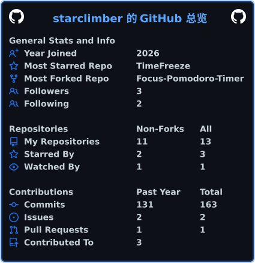

<h1 align="left">👋 你好！我是 <a href="https://git.io/typing-svg"></a></h1>

<!-- 语言统计（左，不缩放） -->


```yaml
前端技术栈:
  - HTML █████████████████████████
  - CSS █████████████████████████
  - JavaScript █████████████████░░░░░░

后端技术栈:
  - PHP ██░░░░░░░░░░░░░░░░░░░░░░░░
  - Node.js (AI生成) █████████████████████████
  - Next.js (AI生成) █████████████████████████

移动开发:
  - Android (AI生成) ██████████████████████████

AI 能力:
  - AI 提示词工程 ██████████████████████████
```

# 我喜欢做点新东西！

<!-- 总览（右，缩小到 300px） -->



[](https://starclimber.my-board.org)
[](https://github.com/starclimber?tab=repositories)
[](https://cdn.v6.ccwu.cc/666.mp4)

- 💬 我正在研究后端
- 🧠 我的特殊能力：AI 提示词工程，能写出高质量的提示词
- 💻 后端与安卓代码大多由 AI 生成，我负责把关和优化
- 📖 了解我做的更多东西，见我的：[个人主页](https://starclimber.my-board.org)
- 📃 我的blog：[blog](https://starblog.totalh.net/wp59/)
- ✨ 我喜欢的前端设计是暗色极简玻璃风
- 💻 欢迎邮件联系我：无

# 贪吃蛇


[](https://starclimber.my-board.org)
[](https://github.com/starclimber?tab=repositories)
[](https://cdn.v6.ccwu.cc/666.mp4)

- 💬 我正在研究后端
- 🧠 我的特殊能力：AI 提示词工程，能写出高质量的提示词
- 💻 后端与安卓代码大多由 AI 生成，我负责把关和优化
- 📖 了解我做的更多东西，见我的：[个人主页](https://starclimber.my-board.org)
- 📃 我的blog：[blog](https://starblog.totalh.net/wp59/)
- ✨ 我喜欢的前端设计是暗色极简玻璃风
- 💻 欢迎邮件联系我：无

# 贪吃蛇

